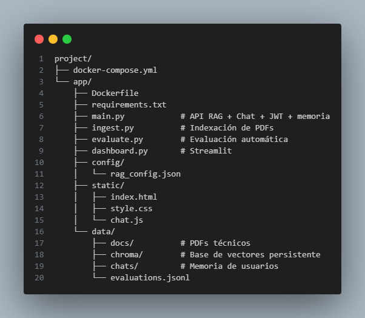

docker compose up --build -d

Servicio URL💬 Chat web [http://localhost:8000](http://localhost:8000)

🧠 API RAG [http://localhost:8000/docs](http://localhost:8000/docs)

📊 Dashboard [http://localhost:8501](http://localhost:8501)

project/├── docker-compose.yml└── app/├── Dockerfile├── requirements.txt├── main.py # API RAG + Chat + JWT + memoria├── ingest.py # Indexación de PDFs├── evaluate.py # Evaluación automática├── dashboard.py # Streamlit├── config/│ └── rag_config.json├── static/│ ├── index.html│ ├── style.css│ └── chat.js└── data/├── docs/ # PDFs técnicos├── chroma/ # Base de vectores persistente├── chats/ # Memoria de usuarios└── evaluations.jsonl

